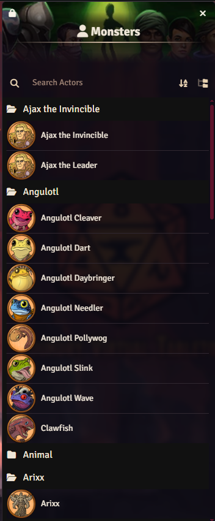

# Drawing Steel: Hand Drawn Draw Steel Monster Tokens by Max Hamm

This module contains tokens for the Draw Steel system for Foundry, implemented via Art Mapping. 
Enabling the module in world will automatically replace the default portraits and tokens in the compendium.
You can control the priority of multiple art packs from the core Foundry settings, via the "Configure Art" menu. 

Check out Max Hamm's Bluesky for tokens as they come out: https://bsky.app/profile/maxhamm.bsky.social